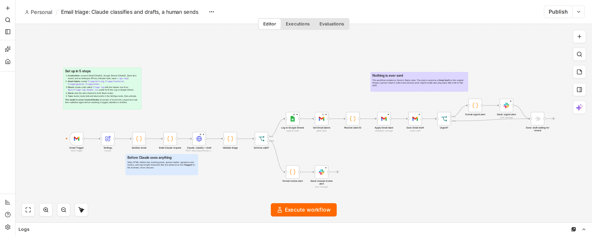
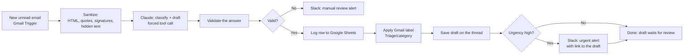

# Email Triage Automation (n8n + Claude)

An n8n workflow that reads each new support email, has Claude classify it and write a draft reply, and saves that reply as a **Gmail draft on the original thread** for a person to review and send. Urgent emails also post a Slack alert that links straight to the draft, so review-and-send is one click.

**Nothing is ever sent automatically.** The workflow has no send step, and a test checks that.



The company in the sample emails ("Harbor") and every person in them are fictional.

## What happens to each email



1. **Gmail Trigger** polls the inbox every minute for unread mail.
2. **Sanitize** turns the email into plain text. It prefers the HTML part, removes hidden elements, tracking pixels, quoted reply history, signatures and legal footers, strips invisible Unicode, and cuts the body at 4,000 characters. This saves tokens and closes a real prompt-injection route: text hidden in the HTML that a person never sees but a model would read.
3. **Claude** is called through the Messages API with a forced tool call (`triage_email`), so the answer always arrives as four typed fields: `category` (billing, technical, general, other), `urgency` (high, medium, low), `summary`, and `suggested_reply`.
4. **Validate** checks the answer again anyway (valid enum values, non-empty and sensible-length text, no truncation). A failure goes to a Slack "manual review" alert with the reason. The email is never dropped.
5. **Log** appends a row to a Google Sheet: received time, sender, subject, category, urgency, summary, any prompt-injection flags, and the thread ID.
6. **Label** applies `Triage/<category>` to the message.
7. **Draft** saves the suggested reply as a Gmail draft on the original thread, addressed to the sender, with the right `Re:` subject and `In-Reply-To` header.
8. **Urgent?** If urgency is `high`, a Slack alert goes to `#support-alerts` with links to the draft and the thread.

## Setup

You need: a Gmail account to read, a Google Sheet, a Slack workspace where you can add an app, and an Anthropic API key. Tested on **n8n 2.41.4** (automated tests) and on n8n Cloud (live run).

1. **Import** `workflow/email-triage.workflow.json` (n8n: Workflows > Import from file).
2. **Create the credentials** and select them on the matching nodes. The imported file contains only placeholders, no secrets.
   - *Gmail OAuth2* for the Gmail Trigger, Get Gmail labels, Apply Gmail label and Save Gmail draft.
   - *Google Sheets OAuth2* for Log to Google Sheets.
   - *Slack API* with an Access Token (the bot token, scope `chat:write`) for the two Slack nodes. Invite the bot to the alert channel.
   - *Header Auth* for the Claude node: name `x-api-key`, value your Anthropic API key. (The node adds the `anthropic-version` header itself.)
3. **Create the Sheet.** Make a tab named `Triage log` whose first row is exactly the header in [`docs/triage-log-header.csv`](docs/triage-log-header.csv): `Received, From, Subject, Category, Urgency, Summary, Flags, Thread ID`. Then put its ID in the Log to Google Sheets node.
4. **Create four Gmail labels:** `Triage/billing`, `Triage/technical`, `Triage/general`, `Triage/other`. If one is missing, that email simply gets no label and everything else still runs.
5. **Slack channel:** the workflow posts to `#support-alerts`. Change it on both Slack nodes if you use another name.
6. **Review the Settings node.** All tunables are there:

   | Setting | Default | Meaning |
   |---|---|---|
   | `model` | `claude-haiku-4-5-20251001` | Claude model used for triage |
   | `maxTokens` | `1024` | Cap on the response length |
   | `maxBodyChars` | `4000` | Email body is cut at this length before it is sent to Claude |
   | `labelPrefix` | `Triage/` | Prefix of the Gmail labels |
   | `mailIndex` | `0` | Which signed-in Google account (`/mail/u/N/`) the Slack links open |

7. **Point the Gmail Trigger at a test inbox first**, then publish the workflow (older n8n versions call this activating it). Publish again after any edit, or the change does not go live.

To try it, follow the [live demo script](docs/DEMO.md). It includes copy-paste test emails and the order to show things in.

## When something goes wrong

| What fails | What happens |
|---|---|
| Claude returns an invalid or incomplete answer (bad category, empty reply, cut off) | Slack manual-review alert with the reason and a link to the thread. No label, no draft, no log row. |
| The Claude API errors or is overloaded | The call is retried (3 tries, 3 seconds apart), then the same manual-review alert. |
| Google Sheets logging fails | The error is swallowed on purpose so the draft still gets saved. The draft matters more than the log. |
| A Gmail label is missing or cannot be applied | The email is not labelled; the draft and alerts still happen. |
| The email contains instructions aimed at an AI | Hidden ones are removed before Claude sees the email. Visible ones are passed through and flagged in the Sheet's `Flags` column. The system prompt tells Claude to treat the email as data. |
| Someone puts `<!channel>` or similar markup in an email | Email text is escaped before it goes into Slack, so it cannot ping anyone. |

**Retry caveat.** n8n's retry-on-fail only looks at the *first* item of a batch. If several emails arrive in one poll and a later one fails, it may go straight to the manual-review alert without retries. It is still escalated to a person, never lost.

## Tests

```bash
npm ci
npm test              # 92 unit tests, runs in about a second, Node 22+
npm run check:build   # fails if the workflow JSON is out of sync with src/
```

**What the unit tests cover.** The sanitizer (HTML to text, hidden-element removal, quoted history, signatures, invisible Unicode, truncation, instruction flags, and pathological inputs that must finish quickly), the response validator, the Slack and Gmail helpers, and the workflow file itself: structure, credentials are placeholders, no secrets, and no node can send mail. The Code-node source is taken straight out of the workflow JSON and run against the eight sample emails in [`samples/emails/`](samples/emails/), so what is tested is what is shipped.

**End-to-end test (18 checks).** `npm run e2e` runs the shipped workflow file inside a real n8n 2.41.4 and answers every outside call (Gmail, Google Sheets, Slack, Anthropic) with local fake servers. It needs Node 24 and an n8n install; see [`e2e/README.md`](e2e/README.md). It sends ten emails in one poll and one more in a later poll, and checks, for example:

- one draft per valid email, addressed to the sender, on the right thread, with the right subject, `In-Reply-To` and body;
- the right label per category, one label lookup per batch, and a missing label does not stop that email's draft;
- one Sheet row per valid email, with injection flags where expected, and none for failures;
- Slack alerts for exactly the two high-urgency emails, each linking to *its own* draft, and manual-review alerts for the two failures (a bad answer and an overloaded API);
- every request to Claude has the forced tool call, the exact schema and system prompt from this repo, and an email block with no HTML, quoted history, signatures, or hidden injection text;
- no call that could send an email ever reaches Gmail;
- a single transient API error is retried and the email is processed exactly once;
- mail that Gmail keeps returning on later polls is not processed twice.

The checks were also **mutation-tested**: deliberately breaking the workflow (wrong urgency rule, no forced tool call, draft paired with the wrong email, hidden text not stripped, Slack text not escaped) makes the end-to-end run fail each time.

### Run on real services

In October 2026 the workflow was run on a test Gmail inbox with the real Gmail, Google Sheets, Slack and Claude (`claude-haiku-4-5-20251001`) services, on n8n Cloud. The emails were fictional, sent from a separate sender account, and processed one at a time over two days. What was confirmed:

- Each email got its label, a Sheet row, and an unsent draft on the original thread. The high-urgency billing email also posted a Slack alert.
- The "Open the draft" link in the Slack alert opened the draft in Gmail, with `mailIndex` set to the signed-in account's position.
- The sanitizer removed the sender's mail-client footer before the email reached Claude.
- The first version of the system prompt let the model invent things. In both runs of the double-charge email, its draft promised a refund, gave made-up deadlines and claimed actions nobody had taken. After the reply rules in `prompts/system-prompt.txt` were tightened, one round of the three demo emails produced drafts that met the checks: no promised refund or deadline for the billing email, no invented features for the onboarding question, and a request for more details for the vague email.

That last result is one run per email. It shows the tightened prompt can pass, not that it always will, and the drafts still need small edits from a person.

### What is *not* verified

Please read this before relying on the project.

- **Draft quality on real mail is unmeasured.** Only the demo emails went through the real model, a handful of times. The wording changes from run to run, and nothing here says how accurate the classifications or drafts are on your company's email. Check that yourself on a test inbox before going live.
- **The automated tests still use fake services.** The unit tests and the 18-check end-to-end run answer every outside call with canned data. They prove the workflow sends the right requests and handles any answer correctly. They do not test the real model.
- **Volume and long-running use are untested** against the real services: Gmail rate limits, many emails in one poll, and how long the Google sign-in stays valid. The real-service runs processed one email at a time.
- **The two prompt-injection samples** were run through the sanitizer in the unit tests, not through the real model.
- Only English emails were tested. Attachments and images are not read. Quoted-reply and signature removal is heuristic and will miss unusual layouts.
- Prompt-injection protection **reduces** risk, it does not remove it. The real safeguard is that a person reads every draft and nothing is sent automatically.

## Repository layout

| Path | What it is |
|---|---|
| `workflow/email-triage.workflow.json` | The importable n8n workflow (generated, do not hand-edit) |
| `src/` | Source of the logic that is inlined into the Code nodes: `sanitize.js`, `validate.js`, `helpers.js` |
| `prompts/system-prompt.txt`, `schema/triage_email.tool.json` | The system prompt and the tool schema sent to Claude |
| `scripts/build-workflow.mjs` | Builds the workflow JSON from the files above (`npm run build`) |
| `samples/emails/` | Eight fictional test emails, including two prompt-injection attempts |
| `test/` | Unit tests (`node:test`) |
| `e2e/` | End-to-end test: fake servers, test emails, runner |
| `docs/` | Demo script, Sheet header, canvas screenshot |

To change the prompt, schema or logic, edit the file in `src/`, `prompts/` or `schema/`, run `npm run build`, then `npm test`.

## License

MIT, see [LICENSE](LICENSE).
